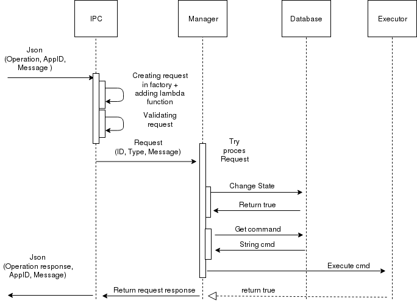

# CoreApp

CoreApp is base app for controling system of container. We can starting, stoping app, installing, uninstalling and updating apps and freezing, unfreezing when we can snapshot container. Input message for this app come over IPC (https://github.com/FleX-d/ICL). IPC message contain type of operation, name of app and some kind of messge or small file in text format. Check if we have save app in database. Database contain all apps allow for this system, contain command for all operation and checksum of appimage. App check state of requested app. We have 4 state: Stop, Run, Freez, Update. All state are linked and we can not change states randomly. Between states are dependence. For example we can not go to Update state form Run state. For updating we must send Stop request and then we can send Update request. According to request we change state if can. Then read from database a command and which ones execute in command line. After executing command send acknowledge message over IPC about state of request.

## Example IPC message
Request
  '{"AppID":"NameOfApp","Message":"Nothing or some text","Operation":"Install"}'

Acknowledge
  '{"AppID":"NameOfApp","Message":"Nothing or error message","OperationResult":"False"}'

## An example of procesing is shown in the figure

link/picture
